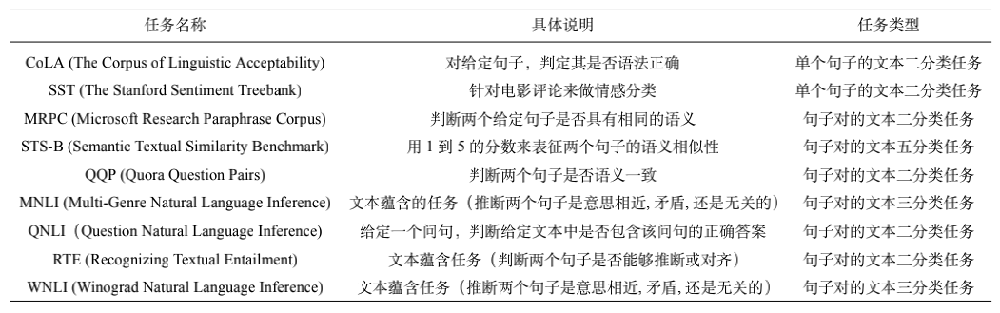
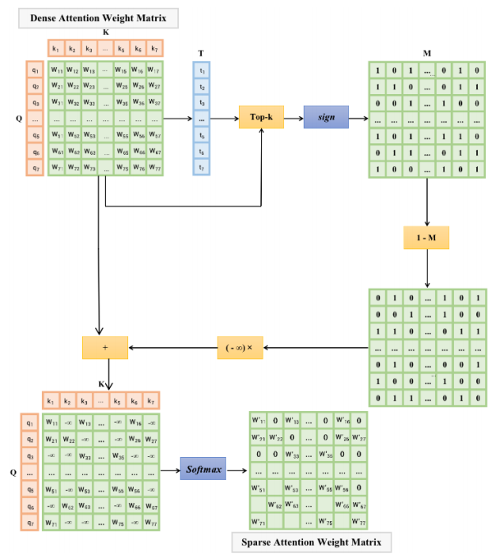
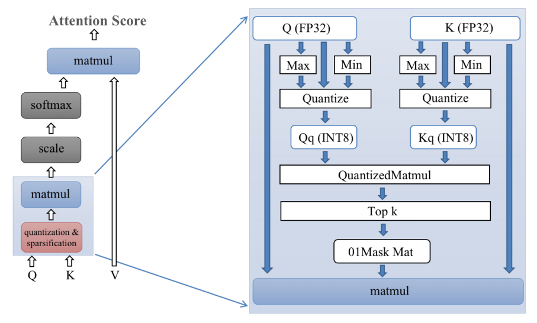

# bert_acceleration

我们的代码部分 fork 自 huggingface 对 transformer 的官方支持：

https://github.com/huggingface/transformers

为了正常运行我们的代码，首先需要安装 transformers 库。在虚拟环境中直接运行

```
pip install transformers
```

对 transformers 库中代码的修改保存在 src 文件夹中，可以使用 src 文件夹中的 modeling_bert.py 替换 Python 库 tranformers 中对应文件，并在相同目录下添加 accerlate_mm.py、customized_attn.py 和 quantized_matmul.py 文件。

text-classification 文件夹中包含用于测试的程序代码。我们在 GLUE 的九个文本分类任务上进行了测试，通过运行 run_glue.py 可以测试不同任务的推理速度和精度。目前支持三组测试，分别是使用 Pytorch 自带的动态量化(Dynamic Quantization) API 加速推理、top-k 的推理精度测试和使用 FBGEMM 加速矩阵乘法。

#### Download Pretrained BERT Model

Download pretrianed bert models from Google Drive: 

https://drive.google.com/drive/folders/1MbDYOENvJGdmLKXAT4JBFoWCjDHzscOI?usp=sharing

There are nine models and their corresponding profiles in this URL, corresponding to nine text classification tasks of GLUE.

这九个预训练模型使用BERT通过高精度稠密注意力（最原始）的方式针对不同下游任务进行微调。这些模型应分别放入 text-classification/glue 目录下的对应文件夹。


#### Test Task 

A specific description of the nine text classification tasks performed based on the GLUE dataset is shown in the table below.




#### 使用 pytorch 自带的动态量化 API 进行加速

动态量化 (dynamic quantization) 指预先量化模型权重，而在运行时动态量化激活函数。这种量化机制适用于 LSTM 和 Transformer 类模型。要运行此步，需要首先注释 run_glue.py 中 465-473 行，取消注释 451-462 行，然后在 text-classification 目录下运行

```bash
export TASK_NAME=mrpc # TASK_NAME can be selected from nine tasks shown above

python run_glue.py \
  --model_name_or_path ./$TASK_NAME \
  --task_name $TASK_NAME \
  --do_eval \
  --no_cuda \
  --overwrite_output_dir \
  --output_dir /tmp/$TASK_NAME/
```

运行结果将会保存在 output_dir 参数下的目录中。

其中，run_glue.py 451-453 行指定量化的模块为全连接层。如果量化多头注意力模块，会导致模型精度大幅度损失；且由于 high-level 的量化 API 只能指定特定模块进行量化，无法满足我们的定制化需求，因此使用 pytorch 自带的动态量化 API 只是用来作为基准测试。

```python
quantized_model = torch.quantization.quantize_dynamic(
	model, {torch.nn.Linear}, dtype=torch.qint8
)
```


#### Accelerate Matrix Multiplication with FBGEMM

This section attempts to use **fbgemm** to speed up the computation of Matrix Multiplication in the attention computation process.

To install fbgemm library.

```bash
cd ./bert_acceleration
chmod 777 ./fbgemm_install.sh
./fbgemm_install.sh
```

To complie C++ file and generate libmm.so library from ./accelerate_mm for attention matrix multiply using.

```bash
chmod 777 ./libmm_generator.sh
./libmm_generator.sh
```

为了运行此步，首先需要注释 modeling_bert.py 315 行，取消注释 306-307 行，然后在 text-classification 目录下运行

```bash
balabala
```


#### Accelerate Attention Computation with Explicit Pattern and Fake Quantization

这里我们使用低精度矩阵乘法计算注意力矩阵并选出每行的 top-k 元素，再进行注意力矩阵特定位置的高精度计算，以期实现不损失太多精度情况下的注意力计算加速。目前，我们使用伪量化模拟低精度计算注意力矩阵的过程。为了运行此步，首先需要注释 modeling_bert.py 315-333 行，取消注释 311-312 行，然后在 text-classification 目录下运行

```bash
export TASK_NAME=mrpc

python run_glue.py \
  --model_name_or_path ./$TASK_NAME \
  --task_name $TASK_NAME \
  --do_eval \
  --no_cuda \
  --overwrite_output \
  --output_dir /tmp/$TASK_NAME/
```

###### Explicit Pattern Selected

The step of accelerated computation is to perform a sparse operation before the matrix multiplication of query and key, i.e., for each query, only the k most similar keys are selected to compute the result of matrix multiplication, and the other positions are ignored, as shown in Fig.



The process of calculating the attention fraction initially introduced is first represented by the following equation:

$Attention(Q,K,V)=Softmax(W_{sim}) * (X_{v}W^V)$

The mask operation M(-) of the sparse attention calculation is implemented on the above $W_{sim}$ (denoted later as $W$) to select the top $k$ most relevant elements, i.e., to select the largest of each row in $W$ $k$ elements in each row of $W$ and record their positions $(i, j)$  in the position matrix, where $k$ is a hyperparameter. For example, let the $k-th$ maximum value of row $i$ be $t_i$, and if the value of the $j-th$ element is greater than $t_i$, then the position is recorded.

We combine the thresholds of each row in series to form a vector $t = [t1, t2, ..., t_{lenQ} ]$, and  mask function $M(-, -)$ can be expressed as


This explicit choice of the first k most relevant keys not only preserves the important information, but also simplifies the model, since the hyperparameter k are taken to be smaller values, such as 4, 8, 16, etc. The selection of the first k large elements is followed by the normalization operation of $Softmax$. Since the positions smaller than the k-th maximum are masked (mask) by the function M(-, -) to negative infinity, their normalized weight values, i.e., the probability of similarity, are approximately 0.

###### 		With Fake-Quantization 

Further adding quantization operations to the computational basis of sparse computation to
expect to further improve the efficiency of the model computation. 

The quantization part is applied to the process of finding the k keys that are most similar to the query words, specifically, the 32-bit floating-point representation of the query matrix and the key matrix are mapped to the 8-bit representation by quantization, and the similarity matrix result is calculated by 8-bit multiplication to find the k keys that are most similar to each query, and return to perform the sparse matrix calculation to obtain the sparse attention score matrix . The process of sparse quantitative attention computation can be represented in Figure.



