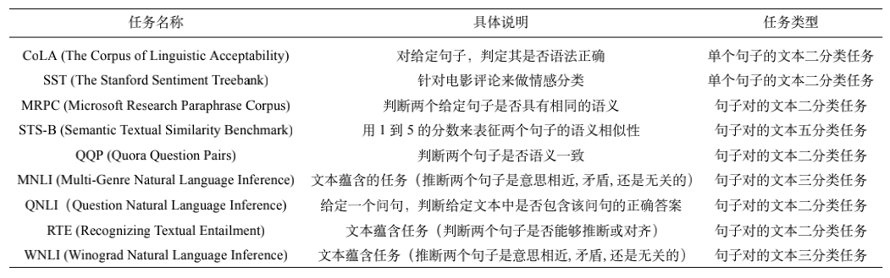
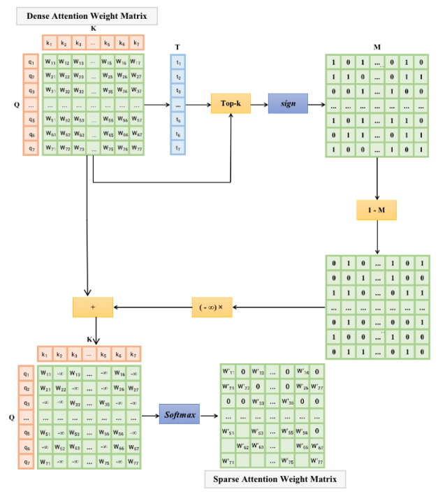
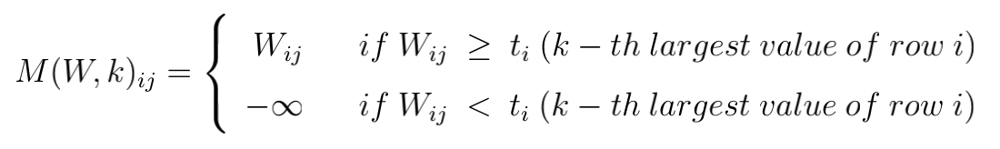
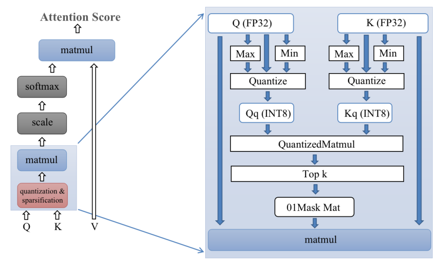

# bert_acceleration

Our based code is forked from huggingface's official support for transformer.

In order to run our code properly, we first need to install the transformers library. Run it directly in a virtual environment:

```
pip install transformers
```

Changes to the code in the transformers library are stored in the **src** folder, so you can use **modeling_bert.py** in the **src** folder to replace the corresponding files in the Python library tranformers, and add **accerlate_mm.py, customized_attn.py, and quantized_matmul.py** files in the same directory.

The **text-classification** folder contains the program code for testing. We have tested GLUE on nine text-classification tasks, and by running **run_glue.py** we can test the inference speed and accuracy of different tasks. Three sets of tests are currently supported: accelerated inference using Pytorch's own Dynamic Quantization API, top-k inference accuracy tests, and accelerated matrix multiplication using FBGEMM.


### Download Pretrained BERT Model

Download pretrianed bert models from Google Drive: 

https://drive.google.com/drive/folders/1MbDYOENvJGdmLKXAT4JBFoWCjDHzscOI?usp=sharing

There are nine models and their corresponding profiles in this URL, corresponding to nine text classification tasks of GLUE.

These nine pre-trained models are fine-tuned for different downstream tasks using BERT by means of high-precision dense attention (most primitive). These models should be placed separately in the corresponding folders in the **text-classification/glue** directory.


### Test Task 

A specific description of the nine text classification tasks performed based on the GLUE dataset is shown in the table below.




### Acceleration using pytorch dynamic quantization API

Dynamic quantization refers to pre-quantizing the model weights and dynamically quantizing the activation functions at runtime. This quantization mechanism is applicable to LSTM and Transformer-like models. To run this step, first comment out lines 465-473 of run_glue.py, uncomment lines 451-462, and then run it in the **text-classification/** directory: 

```bash
export TASK_NAME=mrpc # TASK_NAME can be selected from nine tasks shown above

python run_glue.py \
  --model_name_or_path ./glue/$TASK_NAME \
  --config_name ./glue/$TASK_NAME/config.json \
  --tokenizer_name ./glue/$TASK_NAME/ \
  --cache_dir ./glue/$TASK_NAME/cache \
  --task_name $TASK_NAME \
  --do_eval \
  --no_cuda \
  --overwrite_output_dir \
  --output_dir /tmp/$TASK_NAME/
```

The results will be saved in the directory under the output_dir parameter.

Lines 451-453 of run_glue.py specify that the quantized module is the fully connected layer. Since the high-level quantization API can only specify specific modules for quantization and cannot meet our customization needs, the dynamic quantization API that comes with pytorch is only used as a benchmark test.

```python
quantized_model = torch.quantization.quantize_dynamic(
	model, {torch.nn.Linear}, dtype=torch.qint8
)
```


### Accelerate Matrix Multiplication with FBGEMM

This section attempts to use **fbgemm** to speed up the computation of Matrix Multiplication in the attention computation process.

To install fbgemm library.

```bash
cd ./bert_acceleration
chmod 777 ./fbgemm_install.sh
./fbgemm_install.sh
```

To complie C++ file and generate libmm.so library from ./accelerate_mm for attention matrix multiply using.

```bash
chmod 777 ./libmm_generator.sh
./libmm_generator.sh
```

To run this step, you first need to comment out **modeling_bert.py** line 315, uncomment lines 306-307, and then run it in the text-classification directory:

```bash
export TASK_NAME="mrpc" # TASK_NAME can be selected from nine tasks shown above
python run_glue.py \
  --model_name_or_path ./glue/$TASK_NAME \
  --config_name ./glue/$TASK_NAME/config.json \
  --tokenizer_name ./glue/$TASK_NAME/ \
  --cache_dir ./glue/$TASK_NAME/cache \
  --task_name $TASK_NAME \
  --do_eval \
  --no_cuda \
  --max_seq_length 128 \
  --per_device_eval_batch_size 1 \
  --overwrite_output_dir \
  --output_dir ./tmp/$TASK_NAME/
```


### Accelerate Attention Computation with Explicit Pattern and Fake Quantization

Here we use low-precision matrix multiplication to compute the attention matrix and select the top-k elements of each row, and then perform a high-precision computation of the attention matrix at a specific location in order to achieve a speedup of the attention computation without much loss of precision. Currently, we use pseudo-quantization to simulate the process of computing the attention matrix with low precision. To run this step, first comment out modeling_bert.py lines 315-333, uncomment lines 311-312, and then run it in the text-classification directory:

```bash
export TASK_NAME=mrpc # TASK_NAME can be selected from nine tasks shown above

python run_glue.py \
  --model_name_or_path ./glue/$TASK_NAME \
  --config_name ./glue/$TASK_NAME/config.json \
  --tokenizer_name ./glue/$TASK_NAME/ \
  --cache_dir ./glue/$TASK_NAME/cache \
  --task_name $TASK_NAME \
  --do_eval \
  --no_cuda \
  --overwrite_output_dir \
  --output_dir /tmp/$TASK_NAME/
```

#### Explicit Pattern Selected

The step of accelerated computation is to perform a sparse operation before the matrix multiplication of query and key, i.e., for each query, only the k most similar keys are selected to compute the result of matrix multiplication, and the other positions are ignored, as shown in Fig.



The process of calculating the attention fraction initially introduced is first represented by the following equation:

$Attention(Q,K,V)=Softmax(W_{sim}) * (X_{v}W^V)$

The mask operation M(-) of the sparse attention calculation is implemented on the above $W_{sim}$ (denoted later as $W$) to select the top $k$ most relevant elements, i.e., to select the largest of each row in $W$ $k$ elements in each row of $W$ and record their positions $(i, j)$  in the position matrix, where $k$ is a hyperparameter. For example, let the $k-th$ maximum value of row $i$ be $t_i$, and if the value of the $j-th$ element is greater than $t_i$, then the position is recorded.

We combine the thresholds of each row in series to form a vector $t = [t1, t2, ..., t_{lenQ} ]$, and  mask function $M(-, -)$ can be expressed as



This explicit choice of the first k most relevant keys not only preserves the important information, but also simplifies the model, since the hyperparameter k are taken to be smaller values, such as 4, 8, 16, etc. The selection of the first k large elements is followed by the normalization operation of $Softmax$. Since the positions smaller than the k-th maximum are masked (mask) by the function M(-, -) to negative infinity, their normalized weight values, i.e., the probability of similarity, are approximately 0.

#### 		With Fake-Quantization 

Further adding quantization operations to the computational basis of sparse computation to
expect to further improve the efficiency of the model computation. 

The quantization part is applied to the process of finding the k keys that are most similar to the query words, specifically, the 32-bit floating-point representation of the query matrix and the key matrix are mapped to the 8-bit representation by quantization, and the similarity matrix result is calculated by 8-bit multiplication to find the k keys that are most similar to each query, and return to perform the sparse matrix calculation to obtain the sparse attention score matrix . The process of sparse quantitative attention computation can be represented in Figure.



